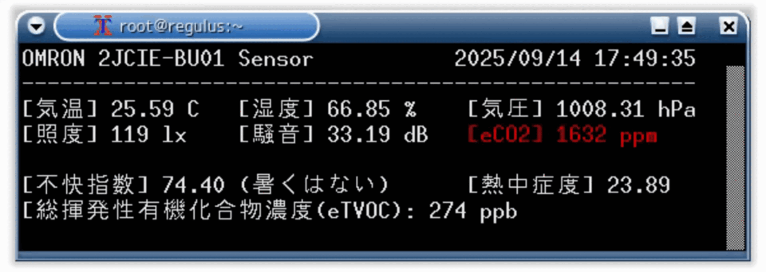

# envtop.py

USB 接続されたオムロン製センサ 2JCIE-BU から情報を読み取り、Linux の top のような表示をするツールです。  
表示をしつつ Prometheus で読み取れる exporter 機能や、様々なデータ交換に扱いやすい CSV 形式での出力機能も備えています。

デスクトップの片隅に表示したり、Prometheus の exporter として使ったり、CSV 出力したファイルを再加工してグラフ化したり電光掲示板のような他のデバイスで情報を表示したりといった用途に使えます。(私が使っています)

## README
- [日本語](./README_ja.md)
- [English](./README_en.md)
